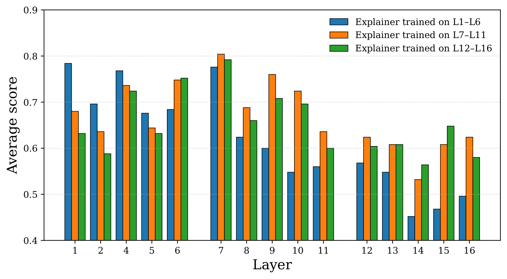
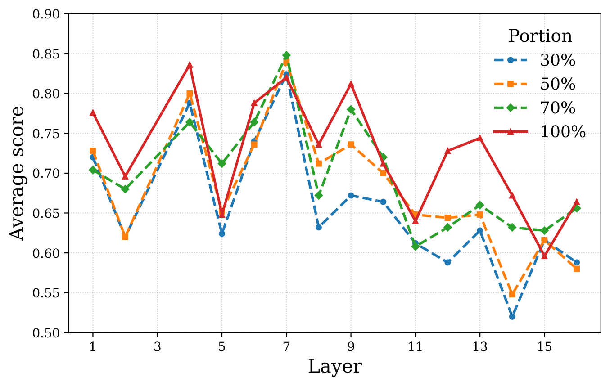
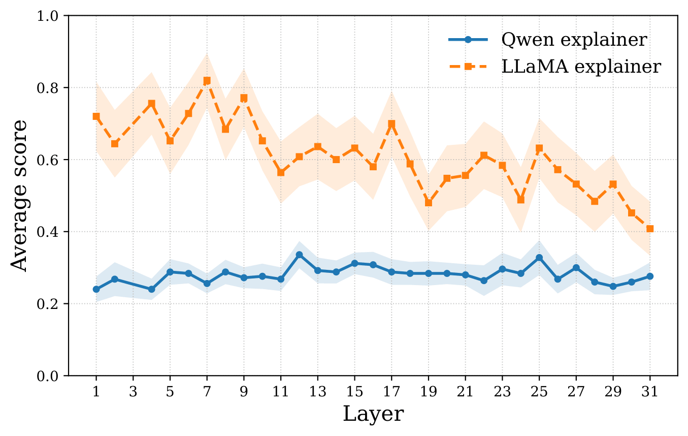

# Training-Language-Models-to-Explain-Their-Own-Computations-Reproducibility-Study

This report presents our reimplementation and partial reproduction of the experiments in [*Training Language Models to Explain Their Own Computations*](https://arxiv.org/pdf/2511.08579). Our goal is to examine whether the paper's main findings can be replicated under a smaller-scale experimental setting. In particular, we reproduce experiments on feature description, activation patching, and input ablation, while also evaluating the claim that language models are better able to explain their own computations than those of a different model family. We also discuss several potential directions for extending this work, motivated by our empirical observations and the limitations encountered during the reproduction study.

## Project Structure

| Part | Folder | Main Idea |
|---|---|---|
| 1 | `1_feature_description` | Train explainer models to describe internal feature vectors from language models |
| 2 | `2_activation_patching` | Study how replacing activations changes model outputs |
| 3 | `3_input_ablation` | Study which parts of the input are important for the model's answer |

---

## Part 1 — Feature Description

This part trains explainer models to generate natural-language descriptions for internal feature vectors.  
The goal is to map a hidden feature or activation vector to a human-readable explanation of what that feature represents.

The experiments compare explainers trained on different layer ranges and different data portions.

  

**Figure 1.** Average explanation scores for explainers trained on different layer groups. The results show that explanation quality changes across layers, with some middle layers receiving higher scores.

  

**Figure 2.** Explainer score versus training-data portion. Using more examples generally improves the average explanation score, especially for several middle layers.

  

**Figure 3.** Comparison between Qwen and LLaMA explainers. In this run, the LLaMA explainer achieves higher average scores across most layers.

---

## Part 2 — Activation Patching

This part studies model behavior using activation patching.  
The idea is to replace an activation from one input with an activation from another input and observe whether the model output changes.

The code builds counterfactual examples and evaluates whether the explainer can predict:

| Metric | Meaning |
|---|---|
| Exact Match | Full explanation matches the target explanation |
| Has-Changed F1 | Whether the model output changes after patching |
| Content Match | Whether the predicted output token matches the target token |

This part helps connect internal activations to causal effects on model predictions.

---

## Part 3 — Input Ablation

This part studies which parts of the input are important for the model's final answer.  
The dataset is built from multiple-choice questions by adding or removing hints and checking whether the model answer changes.

The generated input-ablation dataset contains:

| Item | Value |
|---|---:|
| Generated examples | 12,390 |
| Validation examples | 620 |

Evaluation result on the validation split:

| Metric | Result |
|---|---:|
| Exact Match | 0.00% |
| Has-Changed F1 | 3.66% |
| Content Match | 16.67% |

The low scores show that input-ablation explanation is a difficult task and needs stronger training, cleaner supervision, or a better output format.

---

## Summary

| Part | Main Method | Main Takeaway |
|---|---|---|
| Feature Description | Explainer model for feature vectors | Some layers are easier to explain than others |
| Activation Patching | Counterfactual activation replacement | Internal activations can causally affect predictions |
| Input Ablation | Remove or modify input hints | Predicting input importance is difficult in this setup |

---

## Conclusion

This project explores interpretability methods for language models through feature descriptions, activation patching, and input ablation. The results show that middle layers often contain more explainable structure, LLaMA-based explainers performed better than Qwen-based explainers in the reported comparison, and input-ablation explanation remains challenging.
